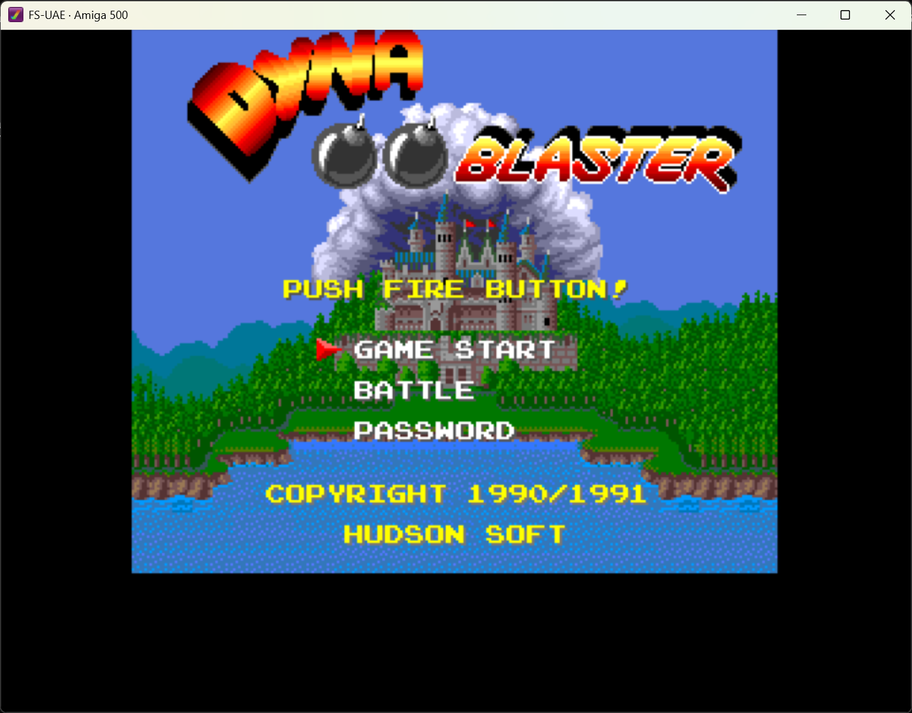

*Dyna Blaster* (the European Amiga port of *Bomberman*) is arguably one of the best retro multiplayer games ever made for the Commodore Amiga.



Setting up Amiga emulation with **FS-UAE** on modern systems is straightforward once you know how the configuration and Kickstart ROMs work. Here is a practical guide on how to get it running smoothly from scratch or via the command line.

---

## 1. What You Need

1. **[FS-UAE](https://fs-uae.net/)**: The cross-platform Amiga emulator.
2. **Game Floppy Image**: Dyna Blaster `.adf` or `.zip` file (e.g. `Dyna Blaster (1991)(Hudson Soft).adf`).
3. **Kickstart 1.3 ROM**: An authentic Commodore Amiga 500 Kickstart 1.3 ROM (named `kick34005.A500`).

**Tip:** While FS-UAE includes an open-source BIOS replacement (AROS), many commercial games like Dyna Blaster and custom loaders require an authentic Kickstart 1.3 ROM to avoid boot loops.

---

## 2. Setting Up the Kickstart ROM

Place your Kickstart 1.3 ROM into the FS-UAE Kickstarts directory and ensure it is named `kick34005.A500`:
- **Windows**: `Documents\FS-UAE\Kickstarts\kick34005.A500` (or `OneDrive\Documents\FS-UAE\Kickstarts\kick34005.A500`)
- **Linux / macOS**: `~/Documents/FS-UAE/Kickstarts/kick34005.A500`

---

## 3. Create the `.fs-uae` Configuration File

In your game directory, create a file named `Dyna_Blaster.fs-uae`:

```ini
[fs-uae]
amiga_model = A500
kickstart_file = kick34005.A500
chip_memory = 512
slow_memory = 512
fast_memory = 0

# Floppy configuration (supports .adf or .zip directly)
floppy_drive_0 = Dyna Blaster (1991)(Hudson Soft).adf
floppy_drive_speed = 100
floppy_drive_volume = 0
accuracy = 1

# Display & Audio
aspect_ratio = auto
fullscreen = 0
window_width = 960
window_height = 720
sound_output = exact

# Controls
joystick_port_0_mode = mouse
joystick_port_1_mode = joystick
```

---

## 4. Launching the Game

### Option A: Double-Click if `.fs-uae` files are registered with FS-UAE in Windows

**How to register `.fs-uae` file association in Windows (no admin required):**
Run the following in PowerShell:
```powershell
$exePath = "$env:LOCALAPPDATA\Programs\FS-UAE\FS-UAE\Windows\x86-64\fs-uae.exe"
New-Item -Path "HKCU:\Software\Classes\.fs-uae" -Value "FSUAE.Config" -Force
New-Item -Path "HKCU:\Software\Classes\FSUAE.Config\shell\open\command" -Value "`"$exePath`" `"%1`"" -Force
```

### Option B: PowerShell (Direct Executable Path)
If file associations are not set:
```powershell
& "$env:LOCALAPPDATA\Programs\FS-UAE\FS-UAE\Windows\x86-64\fs-uae.exe" .\Dyna_Blaster.fs-uae
```

### Option C: 1-Click Batch Script (`play.bat`)
Create a `play.bat` in the game folder:
```cmd
@echo off
start "" "%LOCALAPPDATA%\Programs\FS-UAE\FS-UAE\Windows\x86-64\fs-uae.exe" "%~dp0Dyna_Blaster.fs-uae"
```
