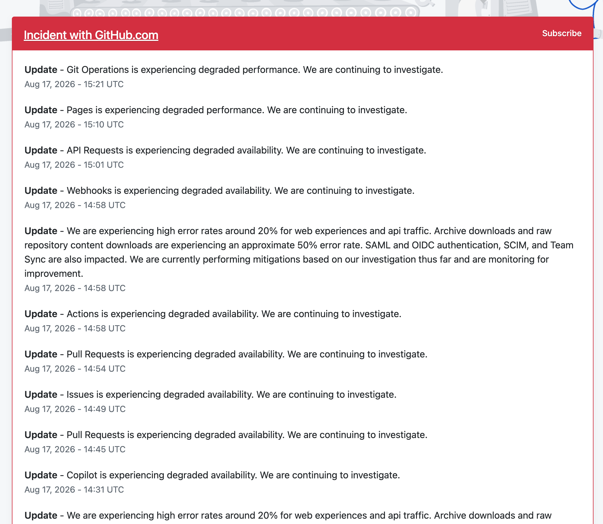
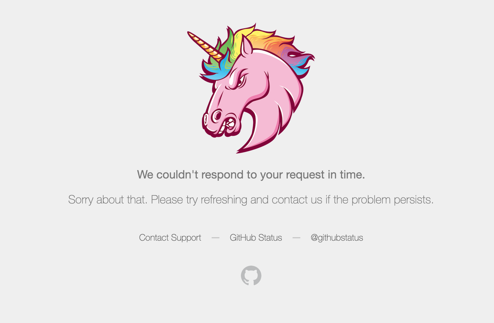

+++
date = '2026-08-17T12:25:31-03:00'
draft = false
title = 'Reviewing Code Locally'
+++

So GitHub is having another incident (https://www.githubstatus.com/), affecting the UI and GitHub Actions:



I usually use GitHub (`https://github.com/<org>/<project>/pull/<pr>/changes`) to review changes, together with checking out the branch to look at details in my code editor, but this time it was not possible to review using the GitHub UI due to the incident:



How to review a PR locally:

- using `git`: `git diff origin/master...HEAD`
- using `gh`: `gh pr diff <pr-number>`

This looks simple, but it's missing line numbers. You can use vim/neovim to get your existing syntax highlighting and line numbers:

```bash
# vim
git difftool -y -t vimdiff origin/master...HEAD
# neovim
git difftool -y -t nvimdiff origin/master...HEAD
```

This approach works fine, but it goes file by file — on a branch with a lot of modified files, that gets annoying for me. This is where [`delta`](https://github.com/dandavison/delta) comes in:

```bash
git diff origin/master...HEAD | delta --line-numbers
```
